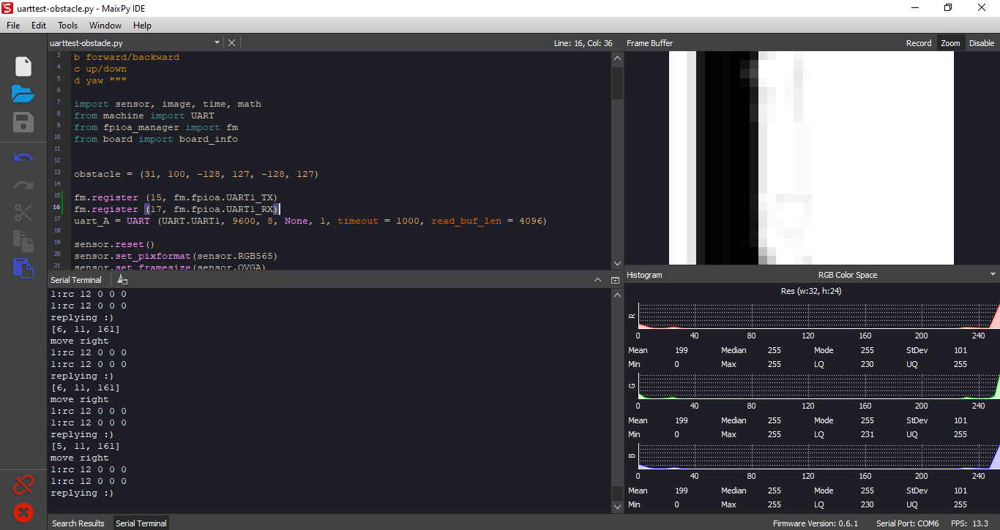
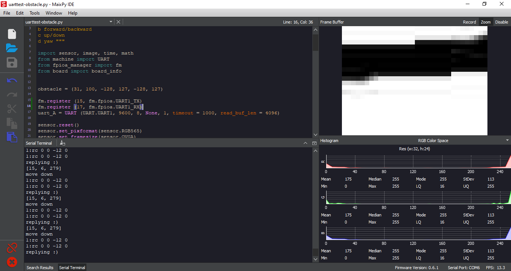
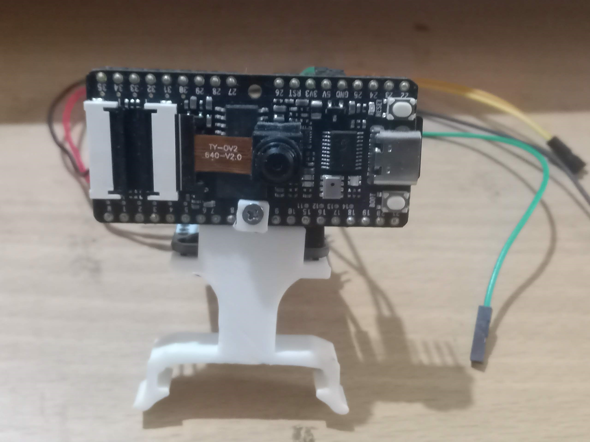
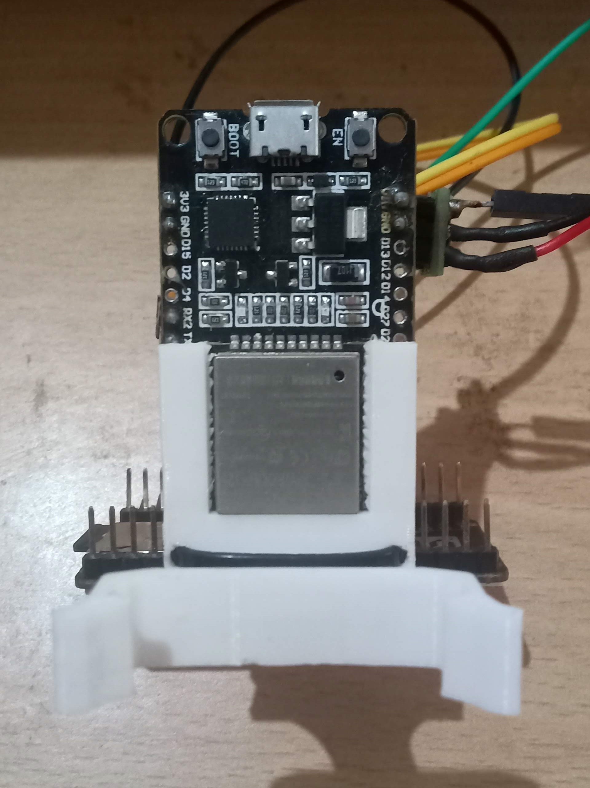
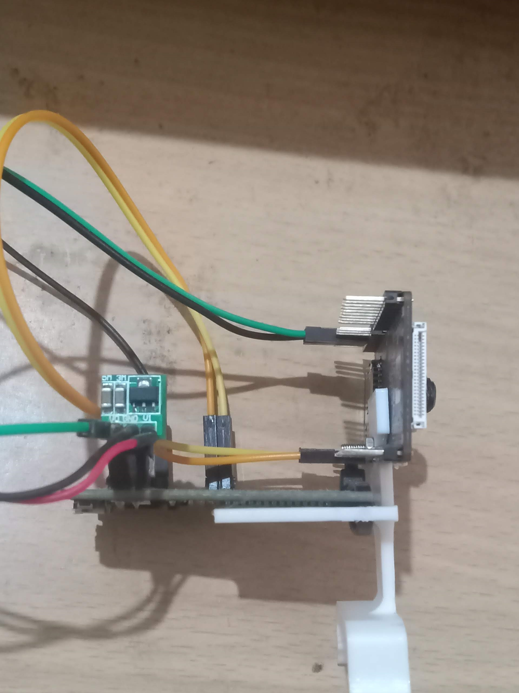
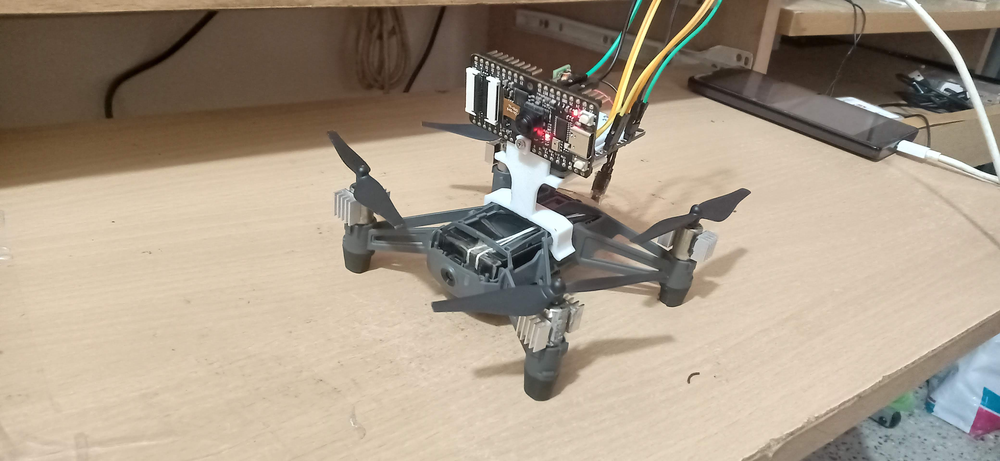
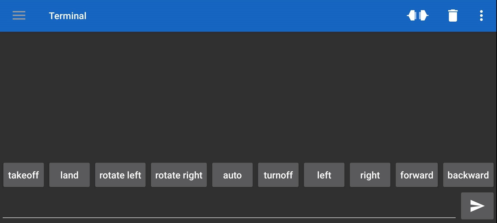
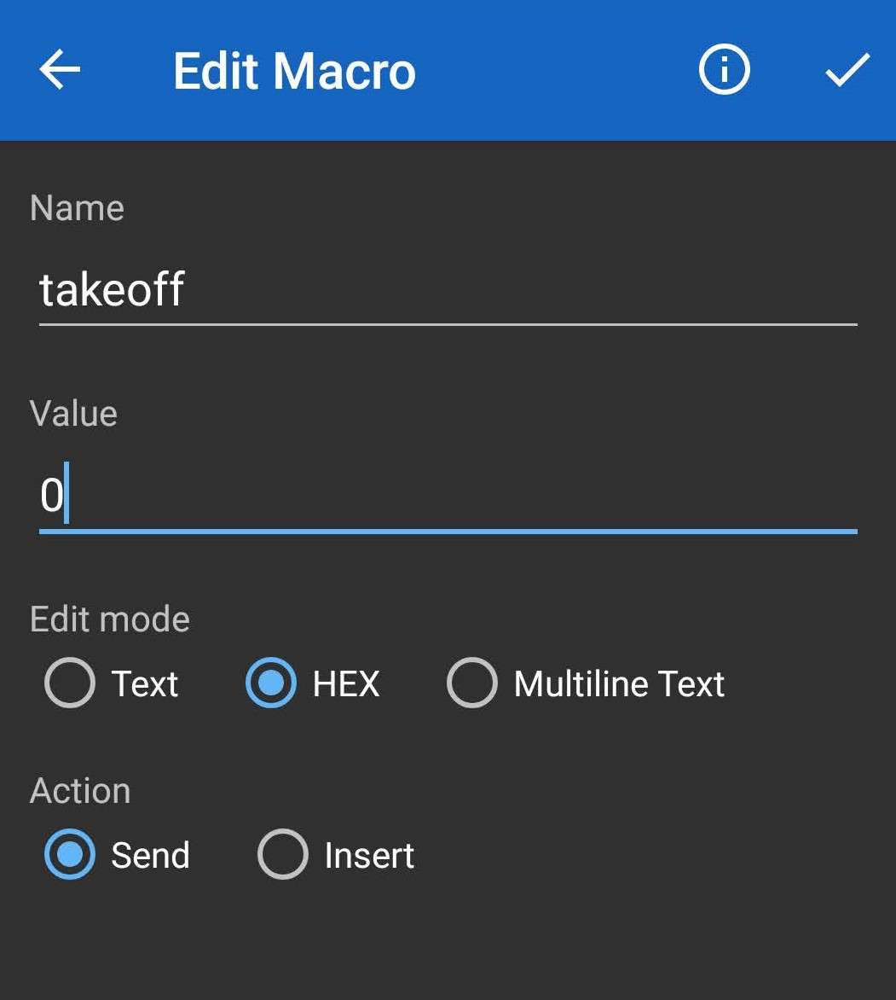

# Vision based obstacle avoiding tello drone

## Intro
This repo contains code to allow tello drone to avoid obstacles using Sipeed maix bit board. ESP32 board is used as a communication bridge between external bluetooth app, maix bit board and tello.

It is inspired by how insects see the world and avoid obstacles/predators even with low resolution vision. A predator or obstacle which is in the field of view appears as a dark blob compared to the surrounding ambient light.

Similarly,the camera input is scaled down to 32 x 24 pixel image. Using thresholding, dark region caused by obstacle is separated from rest of the image. And Based on the size and postion of these blobs the tello is commanded to avoid it.

## Setting up the drone

### Hardware assembly

#### Materials
1) Sipeed maix bit board (with camera) [link](https://www.seeedstudio.com/Sipeed-MAix-BiT-for-RISC-V-AI-IoT-p-2872.html)
2) ESP32 [link](https://www.amazon.com/HiLetgo-ESP-WROOM-32-Development-Microcontroller-Integrated/dp/B0718T232Z/ref=sr_1_3?dchild=1&keywords=esp32&qid=1610295651&sr=8-3)
3) Tello [link](https://www.amazon.com/Tello-CP-PT-00000252-01-Quadcopter-Drone/dp/B07H4W5YWB/ref=sr_1_2?dchild=1&keywords=tello&qid=1610295767&sr=8-2&th=1)
4) boost converter [link](https://www.amazon.com/Comidox-Module-Voltage-Converter-0-9-5V/dp/B07L76KLRY/ref=sr_1_6?dchild=1&keywords=micro+boost+converter&qid=1610295804&sr=8-6)
5) misc. (Wires, ziptie etc)

Mount the boards as shown in the image.  

Make uart connection between the Boards as follows

ESP32 GPIO 16 (UART 2 RX)<-> k210 GPIO 15 (UART 1 TX)  
ESP32 GPIO 17 (UART 2 TX)<-> k210 GPIO 17 (UART 1 RX)

Power the boards using boost converter if using 3.7 volts. For this project the 3.7 volts was tapped from on board battery.

Snap the assembly onto the tello drone

### Software 

Create custom buttons on [Serial Bluetooth terminal app](https://play.google.com/store/apps/details?hl=en&id=de.kai_morich.serial_bluetooth_terminal) as follows:

add hex values for each starting from 0 ie takeoff = hex value 0, land = hex value 1, ...etc   

Add tello library needed by ESP32 to control the drone. [Link](https://github.com/aku-projects/ESP32-Tello)

Modify the tello wifi credentials in .ino file under resources > code > esp32 and program the same into the board.

Set up the Sipeed maix bit board based on the instructions [here.](https://maixpy.sipeed.com/en/)

Now open the micropython script in resources > code > k210 using maix py ide and save the same to the board.

Make sure to change the threshold to correspond to the ambient light of the flight test space.

## Running the Code

Power up the tello drone and the boards. Connect to ESP32 using the app. Wait for ESP32 to connect to Tello wifi. 

Once connected. Take off manually using the corresponding button on the app. Place in Auto mode using the corresponding button. If obstacle is detected the drone moves away from it. And depending on default RC command the drone continues to either hover at place or move forward once the obstacle is removed from the image frame

## Acknowledgment
The tello mount used in this project is a Remix of Raspberry Pi Zero Tello mount by zeroTM on thingiverse : https://www.thingiverse.com/thing:4022999

